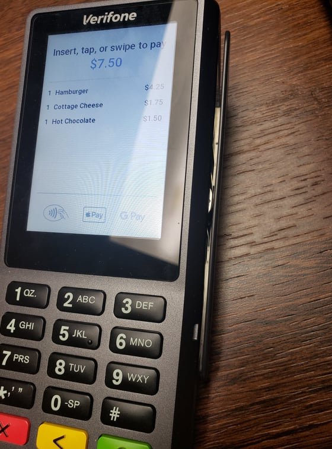

HWK System
===========

This was my first first real-world programming project. I wrote an entire
Point-of-Sale system for my restaurant business.

.. image:: https://i.imgur.com/R5qG7ci.jpeg

The system comprised of 3 Raspberry Pi's connected over WLAN. The POS controlled
the cash drawer and card reader. It sent order info to the cook station (below)
and drink station (above).

.. image:: https://i.imgur.com/7zxwRVI.jpeg

When an order is being made, the price is displayed to the customer by this LCD display

.. image:: https://i.imgur.com/AZj64FS.jpeg

The user sees this screen

.. image:: https://i.imgur.com/3oqtZP3.png

Once the order is created, a receipt is printed

.. image:: https://i.imgur.com/272GFxr.jpeg

The system was real time. Data was transmitted over websockets. When an order was placed, it was queued up and broadcast to receiver. 
When the order was fulfilled by (pressing Enter on the Key Pad), the orders were dequeued. While in queue however, they may be edited.

.. image:: https://i.imgur.com/kmrJIok.png

We could also modify the menu in the POS system

.. image:: https://i.imgur.com/5Vgibij.png

We used a Verifone P400 Terminal provided through Stripe Payment.

